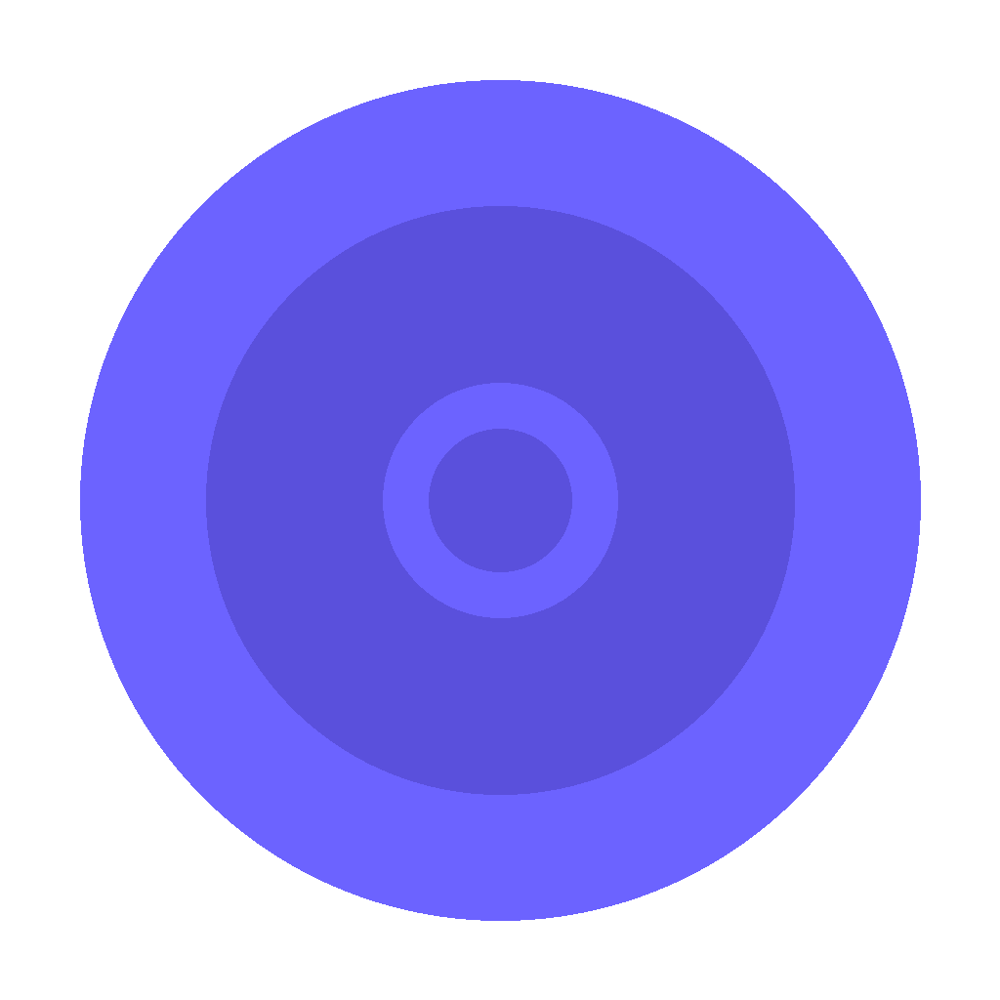

<picture>
  <source media="(prefers-color-scheme: dark)" srcset="assets/icon.png">
  
</picture>

# OmniEmu

**All your games. One place.**

OmniEmu is a cross-platform emulator manager, game launcher, and ROM library for Windows, macOS, and Linux. Install emulators with one click, scan your ROMs, and launch games from a unified library — no terminal required.

---

## Features

- **One-Click Emulator Setup** — Download, install, and auto-configure 20+ emulators from inside the app
- **ROM Library** — Scan your ROMs, browse by platform, and launch games directly
- **Auto-Update** — Built-in updater keeps OmniEmu current without manual downloads
- **Game Art Scraping** — Automatically fetches covers, screenshots, and metadata from SteamGridDB and libretro-thumbnails
- **RetroAchievements** — View per-game achievements in the game detail modal (supports RetroArch, PCSX2, DuckStation, Flycast, melonDS, Mednafen)
- **Controller Navigation** — Navigate the entire UI with a gamepad (DPad, A, B, Start)
- **Controller Config** — Apply PS/Xbox-aware controller bindings to installed emulators in one click
- **BIOS Manager** — Scan your BIOS files and update RetroArch's config in one click
- **Cloud Sync** — Sync save files between devices with built-in Syncthing integration
- **Save Manager** — Browse, back up, and manage save files across all emulators
- **Decomp Projects** — Install and manage PC port projects (Ship of Harkinian, 2 Ship 2 Harkinian, SM64, and more)
- **Video Filters** — Apply CRT shaders and recommended filters to RetroArch
- **Recommended Settings** — One-click optimal config presets for every supported emulator
- **Light & Dark Mode** — Choose your theme or follow the system preference
- **Cross-Platform** — Identical experience on Windows, macOS, and Linux (x64 & ARM64)

## Supported Emulators

| Emulator | Systems | Windows | macOS | Linux |
|---|---|---|---|---|
| Dolphin | GameCube, Wii | ✅ | ✅ | ✅ |
| RPCS3 | PlayStation 3 | ✅ | — | ✅ |
| Eden | Nintendo Switch | ✅ | ✅ | ✅ |
| PCSX2 | PlayStation 2 | ✅ | ✅ | ✅ |
| DuckStation | PlayStation 1 | ✅ | ✅ | ✅ |
| Mednafen | PS1, PC Engine, Lynx, Neo Geo Pocket, WonderSwan | ✅ | ✅ | ✅ |
| MAME | Arcade | ✅ | ✅ | ✅ |
| PPSSPP | PSP | ✅ | ✅ | ✅ |
| melonDS | Nintendo DS | ✅ | ✅ | ✅ |
| Flycast | Dreamcast, Naomi, Atomiswave | ✅ | ✅ | ✅ |
| Cemu | Wii U | ✅ | ✅ | ✅ |
| xemu | Original Xbox | ✅ | ✅ | ✅ |
| Vita3K | PS Vita | ✅ | ✅ | ✅ |
| Azahar | Nintendo 3DS | ✅ | ✅ | ✅ |
| Project64 | Nintendo 64 | ✅ | — | — |
| Snes9x | SNES | ✅ | ✅ | ✅ |
| mGBA | Game Boy, GBA | ✅ | ✅ | ✅ |
| Mesen2 | NES, SNES, GB, GBA, PC Engine | ✅ | ✅ | ✅ |
| RetroArch | Multi-system (NES, SNES, N64, GB/GBA, PS1, and more) | ✅ | ✅ | ✅ |
| ES-DE | Frontend / launcher | ✅ | ✅ | ✅ |

## Quick Start

1. Download the latest release for your platform
2. Launch OmniEmu and go to **Library** → install an emulator
3. Go to **Settings** → set your ROMs directory → **Scan**
4. Browse your library and launch any game

### Downloads

Download the latest build from the [releases page](https://github.com/mileswolfallen2/OmniEmu2.0/releases).

**Note:** The `.yml` files you see in releases are metadata used by the built-in auto-updater — you can ignore them.

### Install Guide

**macOS** — `OmniEmu-*.dmg`: Drag to Applications. Right-click → Open on first launch (unsigned).
```bash
sudo xattr -rd com.apple.quarantine /Applications/OmniEmu.app
```

**Windows** — `OmniEmu-*-win-*.exe`. SmartScreen → More Info → Run anyway. Portable `.zip` versions also available.

**Linux** — `OmniEmu-*-linux-*.AppImage`: `chmod +x` then `./OmniEmu*.AppImage`. Install `libfuse2` if needed.

## Building from Source

### Prerequisites

- Node.js 20+ (recommended: 22)
- npm 10+

### Setup & Run

```bash
npm install
npm run start
```

### Package for Distribution

```bash
# macOS (universal)
npm run package:mac

# Windows
npm run package:win

# Linux
npm run package:linux

# All at once
npm run package:all
```

Output goes to `./release/`.

## License

MIT
